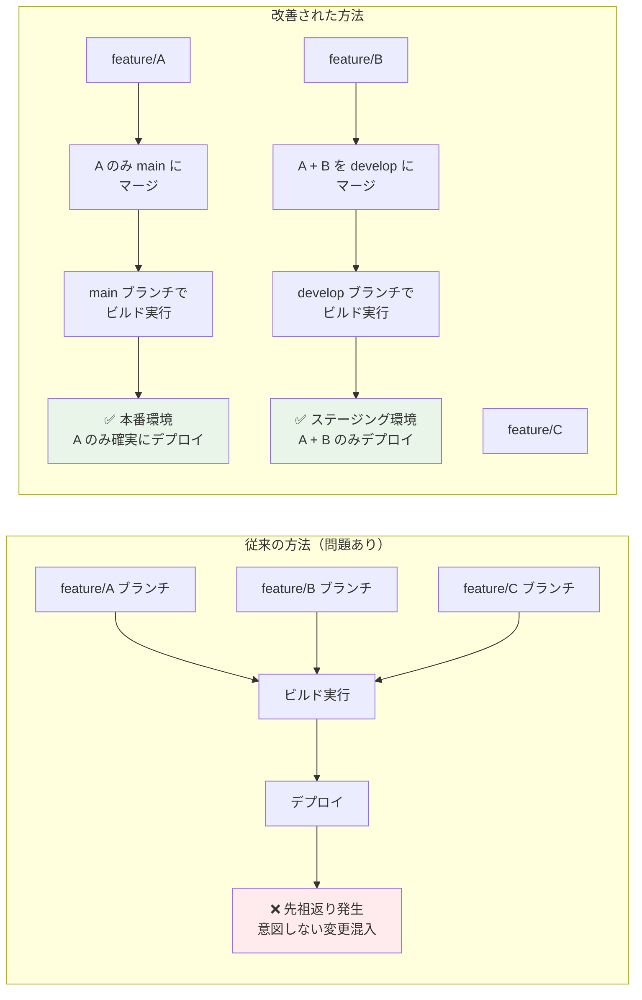
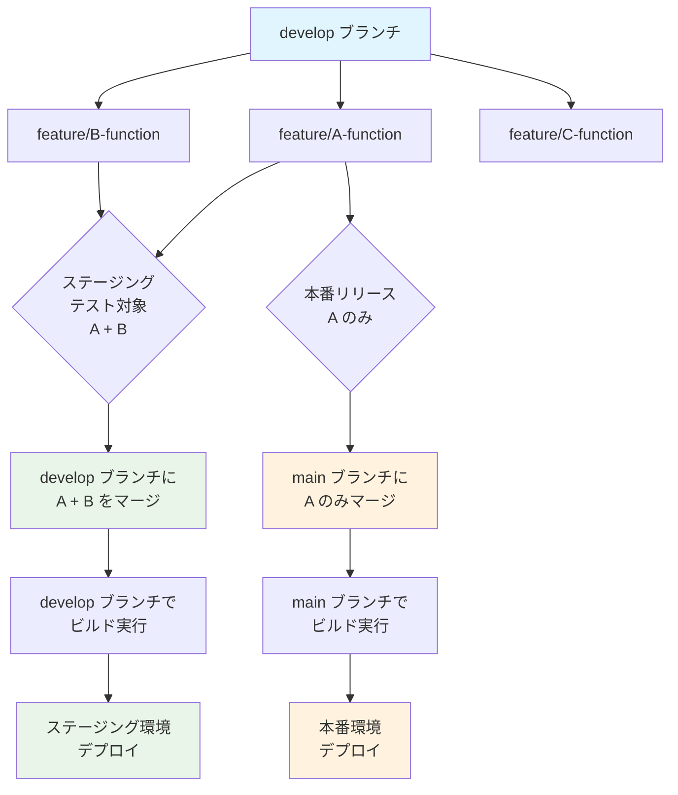

# Git 開発ガイドライン

## はじめに

このガイドラインは、開発の効率性とコードの品質を両立することを目指しています。
ここで示す内容は「ベストプラクティス」であり、状況に応じて柔軟に対応します。
最も大切なのは、**開発のスピードを維持しながら、チームで気持ちよく開発できる環境を作ること**です。

### このガイドラインの目的

-   コードの品質維持と改善
-   レビューによる知見の共有と成長
-   変更履歴の追跡性確保
-   将来の保守性向上

### 運用の基本方針

-   状況に応じて柔軟に判断する
-   スピードを重視する場合は、チームで合意の上でルールを緩和できる
-   複雑な承認フローは避け、信頼ベースで運用する

## 1. コミットメッセージの書き方

推奨するプレフィックス：

-   `[add]` - ファイルの追加
-   `[fix]` - 修正などの対応
-   `[update]` - 更新などの対応
-   `[remove]` - ファイルなどの削除

> **コミットメッセージの例：**
>
> -   `[add] キャンペーンページの追加`

## 2. ブランチ運用について

### メインブランチ

-   `main` - 本番環境用のブランチ
-   `develop` - 開発用の統合ブランチ

> **develop ブランチについて：**
>
> -   常時稼働の開発統合ブランチとして維持
> -   プルリクエスト経由でのみ更新を推奨

### 作業用ブランチ

develop ブランチから派生させて作成：

-   `feature/` - 新機能開発用（例：`feature/login-page`）
-   `fix/` - 修正用（例：`fix/header-layout`）
-   `update/` - 更新用（例：`update/news`）

> **ブランチの作成単位の目安：**
>
> -   機能単位
> -   修正箇所ごと
> -   ページごと

### ブランチの流れ

1. ブランチ作成前に最新の develop ブランチを取り込む
2. develop ブランチから作業用ブランチを作成
3. 作業用ブランチで開発を実施
4. develop ブランチへプルリクエストを作成
5. develop ブランチへマージ
6. 作業用ブランチは削除

## 3. プルリクエストとレビュー

### レビューのフィードバック

-   承認時は「LGTM！」しよう

### マージルール

-   develop ブランチへは、作業者自身がマージボタンを押す
-   コンフリクトが発生した場合は作業者が解消
-   master ブランチへのマージは管理者が行う

## 4. ベストプラクティス

### コミットについて

-   レビューしやすい適切な大きさでのコミットを心がける
-   コミットメッセージは具体的に何を変更したのかわかるように記述する
-   定期的に最新のメインブランチを取り込んでコンフリクトを防ぐ

## 5. サーバーアップについて

### ステージング環境へのデプロイ

-   `develop`ブランチにマージされた内容がステージング環境へデプロイされる
-   ステージング環境は開発中の機能を確認・検証するための環境
-   基本的に`develop`ブランチの内容が反映される

### 本番環境へのデプロイ

-   `main`ブランチにマージされた内容が本番環境へデプロイされる
-   本ガイドラインのブランチ運用ルールに従っていれば、チームメンバー誰でもデプロイ可能
-   デプロイ実施時はチームに共有する

> **本番デプロイの注意点：**
>
> -   デプロイ前に必ずステージング環境で動作確認を済ませておく
> -   大きな変更の場合は、デプロイのタイミングをチームで共有
> -   問題が発生した場合の切り戻し手順を確認しておく
> -   ブランチ運用ルールに従い、適切にマージ・ビルドされた内容のみをデプロイする

## 6. Laravel 開発におけるビルドプロセスとブランチ運用

### 課題：ビルドプロセスでの先祖返り問題

Laravel 開発では、Sass のコンパイルなどのビルドプロセスが必要です。
しかし、従来のワークフローでは以下の問題が発生することがあります：

-   特定のブランチでビルド実行時に、他のブランチの変更が混入する
-   ビルド成果物に意図しない変更が含まれ、先祖返りが発生する
-   どの機能がビルドに含まれているか把握しにくい

#### 従来の問題と改善方法の比較



### 解決策：選択的マージによるビルド管理

#### 基本方針

-   **develop ブランチ**: ステージング環境用
-   **main ブランチ**: 本番環境用
-   各機能ブランチは独立して管理し、必要に応じて選択的にマージ

#### ワークフロー

##### 1. 機能開発フェーズ

```
develop ブランチから以下を作成：
├── feature/A-function
├── feature/B-function
└── feature/C-function
```

##### 2. 全体的な流れ



##### 3. ステージング環境でのテスト

A と B の機能をテストする場合：

1. `feature/A-function` を `develop` ブランチにマージ
2. `feature/B-function` を `develop` ブランチにマージ
3. `develop` ブランチでビルド実行（Sass コンパイル等）
4. ステージング環境にデプロイ

##### 4. 本番環境へのリリース

A 機能のみを本番リリースする場合：

1. `feature/A-function` を `main` ブランチにマージ
2. `main` ブランチでビルド実行
3. 本番環境にデプロイ

#### このアプローチの利点

-   **先祖返りの防止**: 必要な機能のみを選択的にマージするため、不要な変更の混入を防げる
-   **ビルド内容の明確化**: どの機能がビルドに含まれるかが明確
-   **柔軟なリリース計画**: 機能単位で本番リリースのタイミングを調整可能
-   **安全性の向上**: ステージング環境と本番環境で異なる機能セットでテスト可能

#### 注意点

-   機能ブランチは独立性を保つ（相互依存を避ける）
-   マージ前に必ずコンフリクトの確認を行う
-   ビルド後は成果物の内容を確認する
-   リリース後は不要になった機能ブランチを削除する

### ビルドコマンドの実行タイミング

```bash
# ステージング環境用（develop ブランチ）
git checkout develop
npm run build
# または
npm run dev

# 本番環境用（main ブランチ）
git checkout main
npm run build
```

> **重要**: ビルドは必ずデプロイ対象のブランチで実行し、ビルド成果物がそのブランチの内容と一致することを確認してください。
