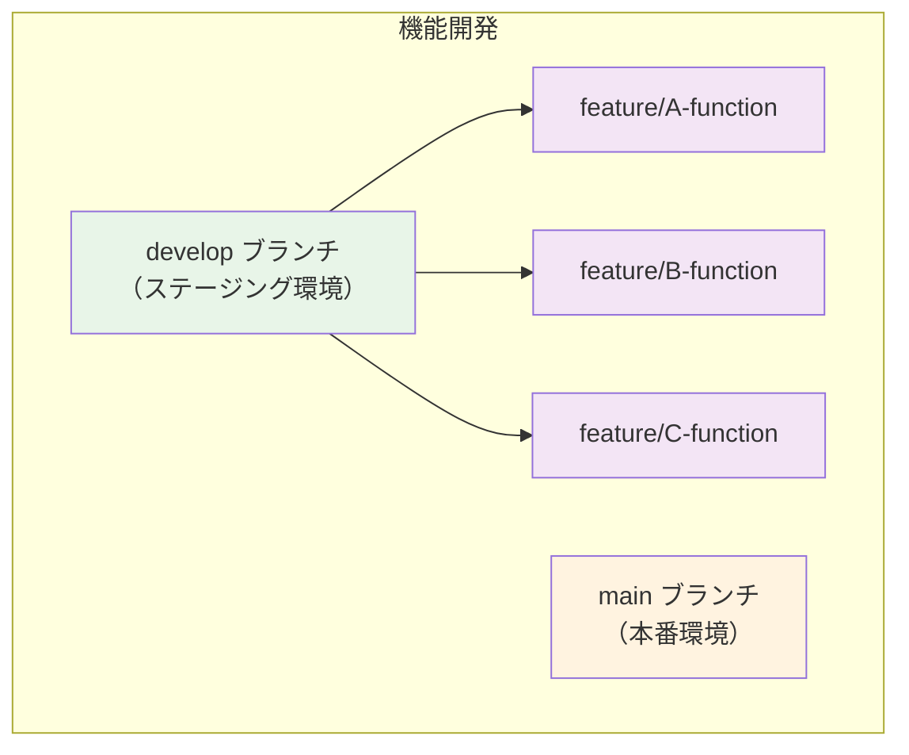
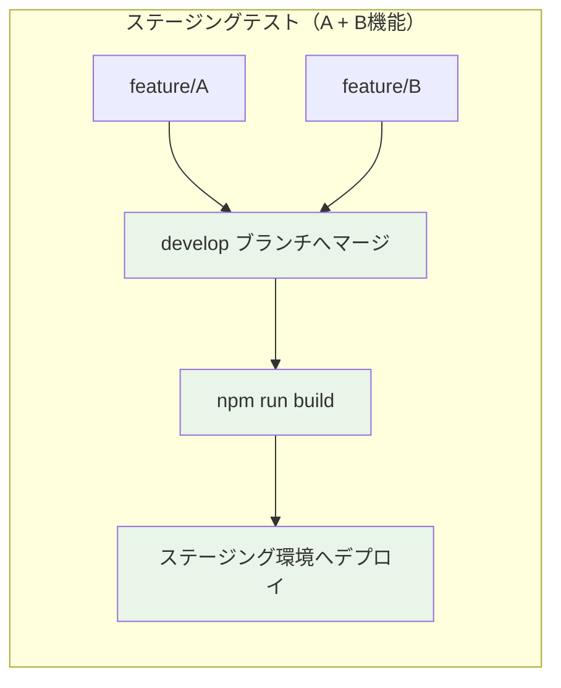
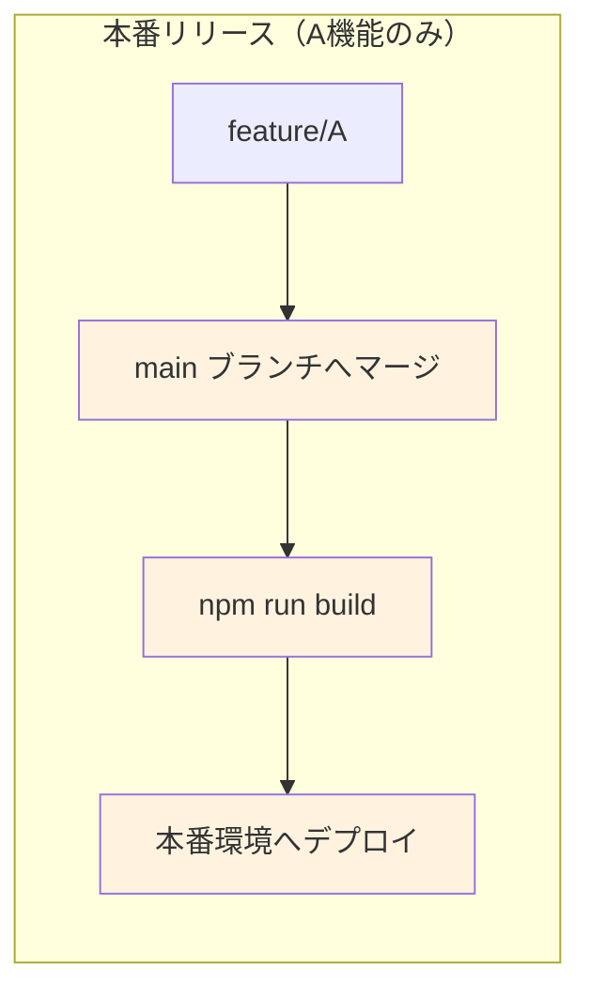

# Git 開発ガイドライン

## はじめに

このガイドラインは、Laravel 開発における効率的なブランチ運用とビルド管理を目的としています。
最も大切なのは、**開発のスピードを維持しながら、先祖返りのない安全なデプロイを実現すること**です。

## 1. 基本的なブランチ構成

### メインブランチ

-   `main` - 本番環境用
-   `develop` - ステージング環境用

### 機能ブランチ

develop ブランチから派生させて作成：

-   `feature/` - 新機能開発用（例：`feature/login-page`）
-   `fix/` - 修正用（例：`fix/header-layout`）
-   `update/` - 更新用（例：`update/news`）

## 2. Laravel 開発のワークフロー

### ブランチ構造



### ステージング環境への流れ



### 本番環境への流れ



## 3. 重要な注意点

### ⚠️ 機能ブランチの独立性を保つ

**禁止事項：**

-   `git rebase`時に他の機能ブランチの変更を取り込む
-   機能ブランチ間での直接的な依存関係を作る

**理由：** 選択的マージができなくなり、「A 機能のみリリース」が不可能になる

### ⚠️ ビルドタイミング

**必須：** マージ後の対象ブランチで必ずビルド実行

```bash
# ステージング環境用
git checkout develop
npm run build

# 本番環境用
git checkout main
npm run build
```

### ⚠️ ブランチ管理

**推奨：**

-   本番リリース後は機能ブランチを削除
-   develop ブランチは定期的にクリーンアップ
-   デプロイ実施時はチームに共有

## 4. コミットメッセージ

推奨するプレフィックス：

-   `[add]` - 機能・ファイルの追加
-   `[fix]` - 修正対応
-   `[update]` - 更新対応
-   `[remove]` - 削除対応

**例：** `[add] ログイン機能の追加`

## 5. プルリクエスト

### 基本ルール

-   develop ブランチへは作業者自身がマージ
-   main ブランチへは本ガイドラインに従えば誰でもマージ可能
-   承認時は「LGTM！」で OK

### デプロイ前の確認

-   ステージング環境で動作確認済み
-   ビルド成果物の内容確認済み
-   デプロイタイミングをチーム共有済み
